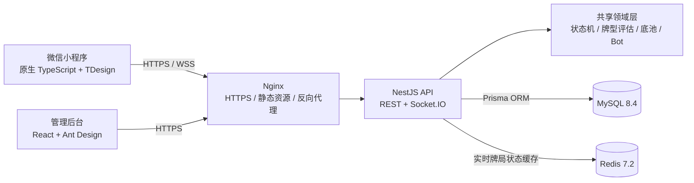

# ALLINLE Poker Platform

> 一个覆盖微信小程序、实时后端与管理后台的 TypeScript 全栈项目，面向线下德州扑克记账和非现金化牌技训练场景。

<p align="center">
  
  
  
  
  
  
</p>

ALLINLE 是一个个人全栈项目，完整实现了客户端、服务端、实时通信、管理后台、数据存储、自动化测试与生产部署。项目重点不只是页面展示，而是处理扑克领域规则、多人房间状态、权限隔离和可运维性等工程问题。

> 合规说明：项目不包含充值、提现、兑换、支付、抽水或现金交易；练习筹码仅用于模拟训练，不具备财产属性。

## 系统架构



项目采用 pnpm Workspace 管理 Monorepo。业务入口拆分为微信小程序、NestJS API 和 React 管理后台，扑克规则与通用类型沉淀在独立共享包中。

## 技术栈

| 层次         | 技术                                         | 用途                                 |
| ------------ | -------------------------------------------- | ------------------------------------ |
| 语言与运行时 | TypeScript 5.5、Node.js 22+                  | 全栈类型约束与服务端运行时           |
| Monorepo     | pnpm Workspace                               | 管理多应用、共享包与统一脚本         |
| 微信小程序   | 微信原生框架、TDesign、weapp.socket.io       | 用户端记账、练习房与数据分析         |
| 管理后台     | React 18、Vite 5、Ant Design 5、React Router | 用户、牌局、风控和系统配置管理       |
| 后端 API     | NestJS 10、RxJS、class-validator、Swagger    | 模块化 REST API、校验和接口文档      |
| 数据层       | MySQL 8.4、Prisma 5                          | 关系建模、类型安全查询与迁移         |
| 缓存         | Redis 7.2、ioredis                           | 实时牌局状态缓存与健康检查           |
| 实时通信     | Socket.IO 4、WebSocket                       | 好友房间状态和牌局事件同步           |
| 身份与安全   | JWT、bcryptjs、Helmet、RBAC                  | 登录、令牌隔离、密码散列和权限控制   |
| 测试与质量   | Vitest、TypeScript、Prettier                 | 单元测试、类型检查和代码格式化       |
| 部署运维     | Docker Compose、PM2、Nginx、Certbot          | 数据服务、进程管理、HTTPS 与反向代理 |

## 核心功能

### 记账系统

- 个人牌局与团队牌局记账；
- 买入、兑现、盈亏和牌局汇总；
- 团队成员、房间与历史记录管理；
- 个人及团队维度的数据统计。

### 实时练习系统

- 好友私密练习房创建与加入；
- 准备、初始筹码确认、牌局动作和下一手流程；
- 基于 JWT 的 Socket.IO 连接鉴权；
- 房间状态、公共牌面与私人手牌分层传输；
- 手牌历史与复盘数据查询。

### 单人 Bot 训练

- 完整的牌堆、发牌、牌型评估与底池计算；
- 翻牌前和翻牌后的 Bot 决策模块；
- 可测试的扑克状态机与合法动作约束；
- 练习统计、趋势分析和历史复盘。

### 管理后台

- `SUPER_ADMIN`、`ADMIN`、`OPERATOR` 三级 RBAC；
- 用户、管理员、记账牌局和练习房管理；
- 手牌详情、风险日志与审计日志查询；
- 系统配置与运营数据面板；
- 用户令牌和管理员令牌使用独立密钥与守卫。

## 工程亮点

### 1. 独立扑克领域层

`packages/shared` 将容易出错的扑克规则从 Web 框架中拆出，包含：

- 牌堆生成与洗牌；
- 牌型识别和强度比较；
- 主池与边池计算；
- 游戏阶段和玩家动作状态机；
- 翻牌前、翻牌后 Bot 策略。

领域逻辑保持纯函数和明确类型边界，可独立测试，也避免控制器或页面层重复实现规则。

### 2. 模块化 NestJS 后端

API 按认证、用户、团队、记账、练习房、牌局、统计、风控、后台管理和健康检查拆分模块。统一使用 DTO 校验、响应拦截器、异常过滤器和错误码，降低接口行为不一致的问题。

### 3. 实时状态与数据边界

Socket.IO Gateway 负责连接鉴权和房间事件，领域服务负责状态变更，Prisma 负责持久化。公共牌局状态与玩家私人手牌分别下发，避免将不应公开的数据广播给整个房间。

### 4. 安全与权限设计

- 微信登录通过服务端 `code2Session` 完成，不向客户端返回 `session_key`；
- 用户 JWT 与管理员 JWT 使用不同密钥和身份范围；
- 密码使用 bcrypt 散列；
- API 提供参数白名单、限流、Helmet 安全头和生产错误脱敏；
- 管理操作、风险事件和关键业务事件保留审计记录；
- 安全服务可检测生产环境默认密钥，并对日志中的令牌、密码等字段脱敏。

### 5. 可重复部署与运维

- Prisma migration 区分开发生成与生产应用；
- Docker Compose 提供 MySQL/Redis 开发和生产配置；
- PM2 配置支持自定义安装目录、日志目录和内存限制；
- Nginx 模板覆盖 REST、Socket.IO、静态后台和 HTTPS；
- 提供健康检查、数据库备份、保留周期和带确认的恢复脚本。

## 自动化测试

当前共有 45 项自动化测试：

| 测试层     | 数量 | 覆盖内容                                                 |
| ---------- | ---: | -------------------------------------------------------- |
| 共享领域层 |   20 | 牌堆、牌型、底池、状态机、Bot 策略                       |
| API 服务层 |   25 | 微信登录、RBAC、安全检查、事件日志、游戏锁、团队账目平衡 |

```bash
pnpm typecheck
pnpm test
pnpm --filter @allinle/api test
pnpm build
```

## 项目结构

```text
allinle-poker-platform/
├── apps/
│   ├── api/             # NestJS API、Socket.IO、Prisma schema
│   ├── admin/           # React + Ant Design 管理后台
│   └── miniprogram/     # 原生微信小程序
├── packages/
│   └── shared/          # 扑克领域引擎、类型、枚举、错误码
├── deploy/
│   ├── nginx/           # 通用 Nginx 配置模板
│   ├── pm2/             # API 进程配置
│   └── scripts/         # 主机初始化、备份与恢复脚本
├── docker/              # MySQL 初始化资源
├── docs/
│   ├── api-tests/       # 可直接执行的 HTTP 接口测试
│   └── deployment.md    # 通用生产部署指南
├── docker-compose.yml
└── docker-compose.prod.yml
```

## 本地运行

### 环境要求

- Node.js 22+，推荐 Node.js 24 LTS；
- pnpm 11；
- Docker Desktop 或 Docker Engine；
- 微信开发者工具。

### 启动 API 与管理后台

```bash
git clone https://github.com/MickeyRay0624/allinle-poker-platform.git
cd allinle-poker-platform
pnpm install

cp .env.example .env
docker compose up -d

pnpm prisma:generate
pnpm prisma:migrate
pnpm prisma:seed
pnpm dev
```

启动后：

| 服务     | 地址                             |
| -------- | -------------------------------- |
| API      | `http://localhost:3000/api`      |
| Swagger  | `http://localhost:3000/api/docs` |
| 管理后台 | `http://localhost:5173`          |
| MySQL    | `127.0.0.1:3306`                 |
| Redis    | `127.0.0.1:6379`                 |

### 运行微信小程序

```bash
pnpm build:miniprogram:local
```

然后在微信开发者工具中导入 `apps/miniprogram`。本地开发配置位于 `.env` 和小程序项目配置文件中，生产密钥不得提交到仓库。

## 生产部署

项目提供 Ubuntu、PM2、Nginx、Certbot、Docker Compose、Prisma migration 和数据库备份的完整流程：

**[查看通用生产部署指南](docs/deployment.md)**

## 后续演进方向

- 接入 Socket.IO Redis Adapter，支持多 API 实例横向扩展；
- 增加端到端测试与 GitHub Actions CI/CD；
- 将上传文件迁移至对象存储；
- 接入结构化日志、指标与告警平台；
- 继续拆分统计查询与实时牌局写模型。

---

Maintained by [MickeyRay0624](https://github.com/MickeyRay0624)
